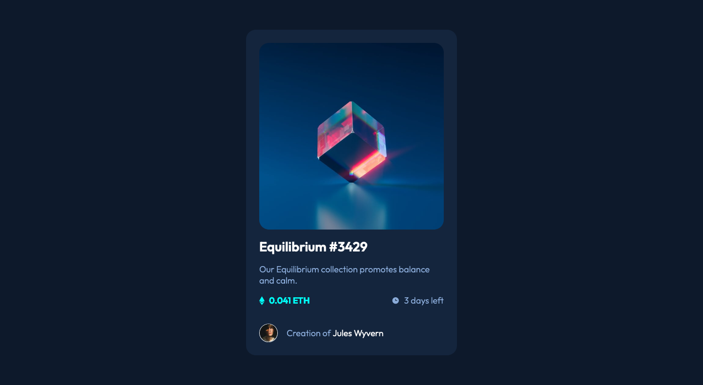

# NFT preview card component solution

This is a solution to the [NFT preview card component challenge on Frontend Mentor](https://www.frontendmentor.io/challenges/nft-preview-card-component-SbdUL_w0U).

This was a fun quick project to work on. When I first started building websites, it was diffcult to work with CSS. CSS was often confusing but as I continue to code more, the easier it got.

### Screenshot

### Links

- GitHub Repo: [https://github.com/surla/nft-preview-card-component](https://github.com/surla/nft-preview-card-component)
- Live Site Url: [https://surla.github.io/nft-preview-card-component/](https://surla.github.io/nft-preview-card-component/)

## Author

- Website - [https://www.josephsurla.com](https://www.josephsurla.com)
- Frontend Mentor - [@surla](https://www.frontendmentor.io/profile/surla)
- Twitter - [@josephsurla](https://www.twitter.com/josephsurla)
